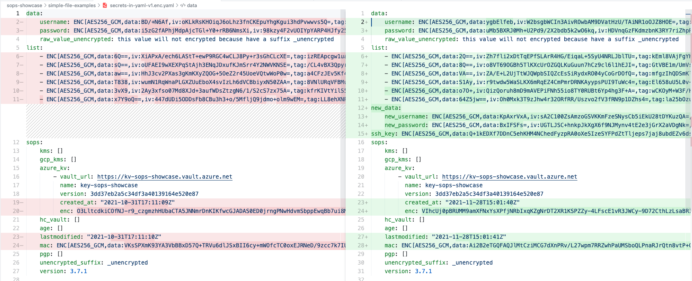

# mozilla sops-showcase

<!-- markdownlint-disable -->
<!-- TOC -->

- [mozilla sops-showcase](#mozilla-sops-showcase)
    - [Why SOPS?](#why-sops)
    - [SOPS best features](#sops-best-features)
    - [SOPS & Azure](#sops--azure)
        - [Azure key vault setup](#azure-key-vault-setup)
        - [Azure key vautl with SP user](#azure-key-vautl-with-sp-user)
    - [File description](#file-description)
    - [Encrypt file](#encrypt-file)
    - [Decrypt file](#decrypt-file)
    - [SOPS and multiple keys encryption/decryption](#sops-and-multiple-keys-encryptiondecryption)
    - [Configuration file: Use .sops.yaml to save encryption logic and rules](#configuration-file-use-sopsyaml-to-save-encryption-logic-and-rules)
    - [Best practice](#best-practice)
    - [Documentation & sources](#documentation--sources)
    - [SOPS installation on MAC](#sops-installation-on-mac)

<!-- /TOC -->
<!-- markdownlint-enable -->
<!-- markdownlint-disable MD004 MD013 -->

## Why SOPS?

<https://github.com/mozilla/sops#motivation>

## SOPS best features

* allow encription without password, you demand the RBAC checks and keys
 store to the cloud
* allow the creation of a single source of truth, using a repository and allow the share of the secrets without fear of loosing everything
* encription of only the values and not the keys, so is more simple to understand if something change during the manipulation
* understand if new data was added and when it was done



## SOPS & Azure

For ours example is mandatory to have:

* Azure account with a key vault (follow the giude bellow to create one)
* GPG local key as backup

### Azure key vault setup

```bash
# Set subscription
az account set --subscription <your subscription>
# Create a resource group
az group create -n sops-showcase -l germanywestcentral
```

```bash
# create a Key Vault instance
az keyvault create -n kv-sops-showcase \
   -g sops-showcase \
   -l germanywestcentral 
```

```bash
# create an key for encryption / decryption 
az keyvault key create -n key-sops-showcase \
    --vault-name kv-sops-showcase \
    --ops encrypt decrypt \
    --protection software
```

> ⚠️ after the key creation is mandatory to allow your user in the section "access policies" to encript/decrypt

### Azure key vautl with SP user

> For more secure workflow for exmaple with SP users, please follow this guide <https://www.thorsten-hans.com/encrypt-your-kubernetes-secrets-with-mozilla-sops/> or <https://github.com/mozilla/sops#encrypting-using-azure-key-vault>

## File description

Sops allow to use this file formats:

* yaml
* json
* binary
* env
* ini

You can find some examples into the folder `simple-file-examples` or read doc <https://github.com/mozilla/sops#important-information-on-types>

## Encrypt file

```bash
# Encrypt file
## Load key unique identifier
KV=$(az keyvault key show --name $KEY_NAME --vault-name $KEY_VAULT_NAME | jq -r ".key.kid")
## e.g.
KV=$(az keyvault key show --name key-sops-showcase  --vault-name kv-sops-showcase | jq -r ".key.kid")
echo $KV #show the url

sops --encrypt --azure-kv $KV secrets-in.dec.yaml > secrets-in.enc.yaml
# e.g.
sops --encrypt --azure-kv https://kv-sops-showcase.vault.azure.net/keys/key-sops-showcase/3dd37eb2a5.....520e87 secrets-in.dec.yaml > secrets-in.enc.yaml
```

## Decrypt file

Show values inside terminal

```bash
sops --decrypt secrets-in.enc.yaml
```

If you want to do that inside an editor (vim)

```bash
sops --decrypt secrets-in.enc.yaml
```

## SOPS and multiple keys encryption/decryption

SOPS allow you to encrypt/decrypt every file with more than one key, in this way you can choose how to manage the security and the visibility of the files.

For example you can encrypt your development files with a DEV & PROD keys, is this way you can delete the development key (an error) in the future, but be able to decrypt the values with your production key.
Or remove the permission to some persons in dev, and still be able to decrypt the values.

## Configuration file: Use .sops.yaml to save encryption logic and rules

Sops is great but every time you need to pass and remember the keys url, and other parameters.
To avoid this tedius operation, you can use a config file called `.sops.yaml` saved in the root directory,
that allow to save the creation rules, that can be configured depends on a regexp on files

for example:

> ⚠ in the config file the key related to azure is `azure_keyvault` and not `azure-kv`

```yaml
# creation rules are evaluated sequentially, the first match wins
creation_rules:
  # upon creation of a file that matches the pattern dev.yaml,
  # AZURE_KMS set A is used
  - path_regex: .*/development/.*
    azure_keyvault: 'https://kv-sops-showcase.vault.azure.net/keys/key-sops-showcase/3dd37eb2a5c34df3a40139164e520e87'

  # prod files use AZURE_KMS set B in the PROD IAM
  - path_regex: .*/production/.*
    azure_keyvault: 'https://kv-sops-showcase.vault.azure.net/keys/key-sops-showcase/3dd37eb2a5c34df3a40139164e520e87'
    pgp: '61325F2CBC748D2BA8C057FF3E0C7C5AA552FC1A'

  # Finally, if the rules above have not matched, this one is a
  # catchall that will encrypt the file using KMS set C
  # The absence of a path_regex means it will match everything
  - pgp: '61325F2CBC748D2BA8C057FF3E0C7C5AA552FC1A'
```

in this example there are tree creation rules, that will be activated every time that use sops.
Each rules will be activated when the folder that you use is inside the regexp.

```bash
sops dev.enc.yaml
```

as you can see, we don't need anymore to add the keyvault id

1. the first rules say that in the folder `development`, we will use only azure key to encrypt the files
2. the second rules, say that into the `production` folder we will use two keys, this is a best practice to have allways a backup just in case that the cloud will be not reachable
3. the third rule says that for every folder not included into the previus folder, only a pgp will be used

Note:

In the rule: ´.*/production/.*´ there are two keys, this means that you use two key for the encryption, but you need only one key for the de-cryption.
So in case for example azure vault is no reachable you can still use your local PGP key (this is a best practice, see **Best Practice** )

## Best practice

1. to avoid problems with cloud connection, is better to use at least two keys. For example one in cloud and one in local

## Documentation & sources

* <https://github.com/mozilla/sops>
* <https://www.youtube.com/watch?v=V2PRhxphH2w>
* <https://www.thorsten-hans.com/encrypt-your-kubernetes-secrets-with-mozilla-sops/>
* [Azure .sops.yaml file](https://github.com/mozilla/sops/issues/436)

## SOPS installation on MAC

```bash
brew install sops

brew install gnupg
```
